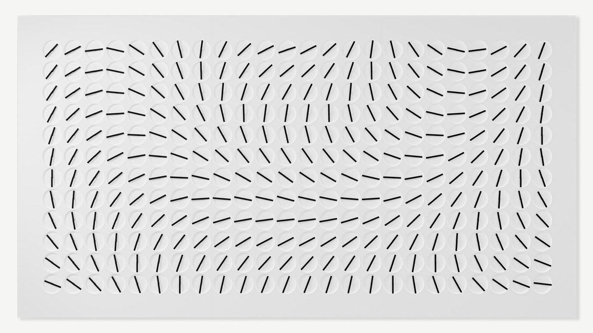
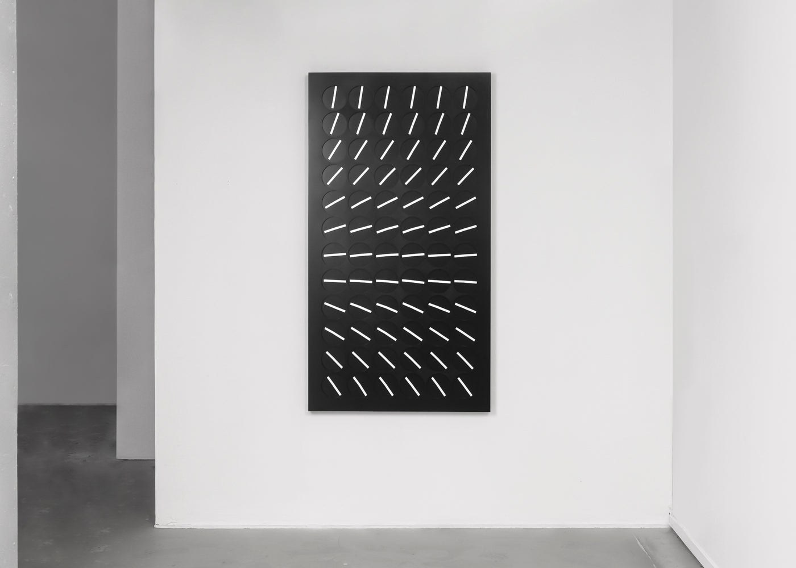
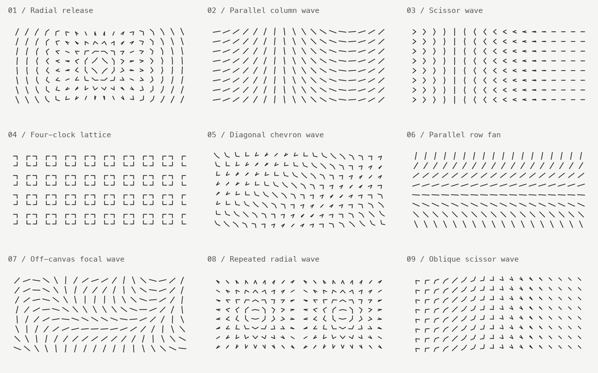
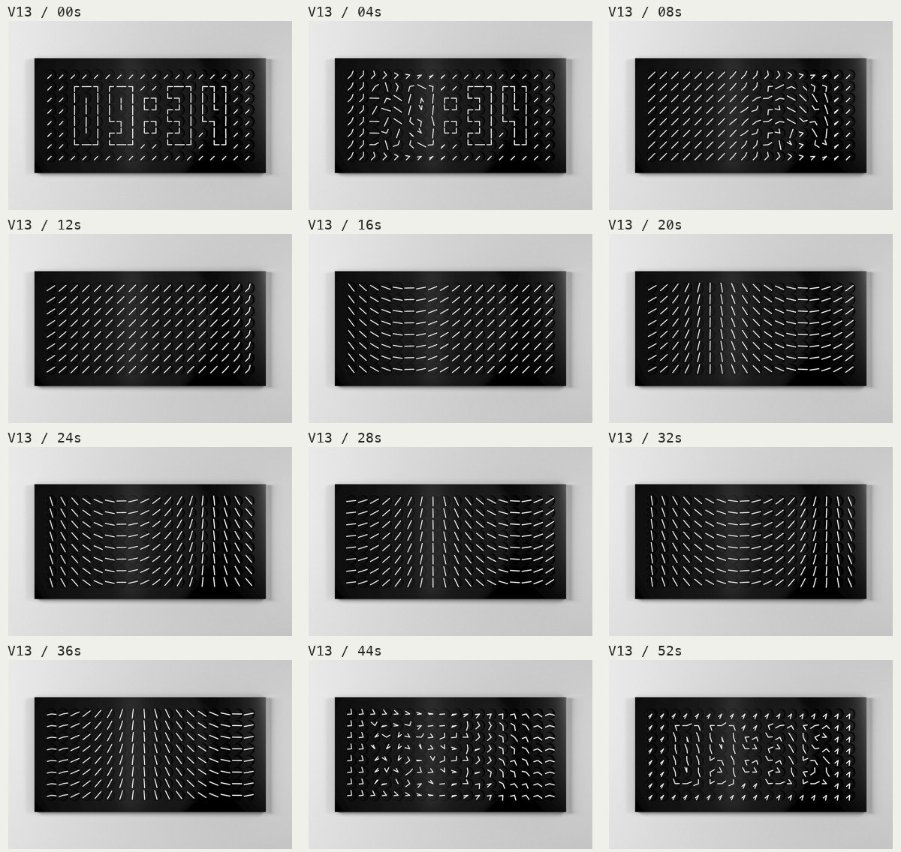
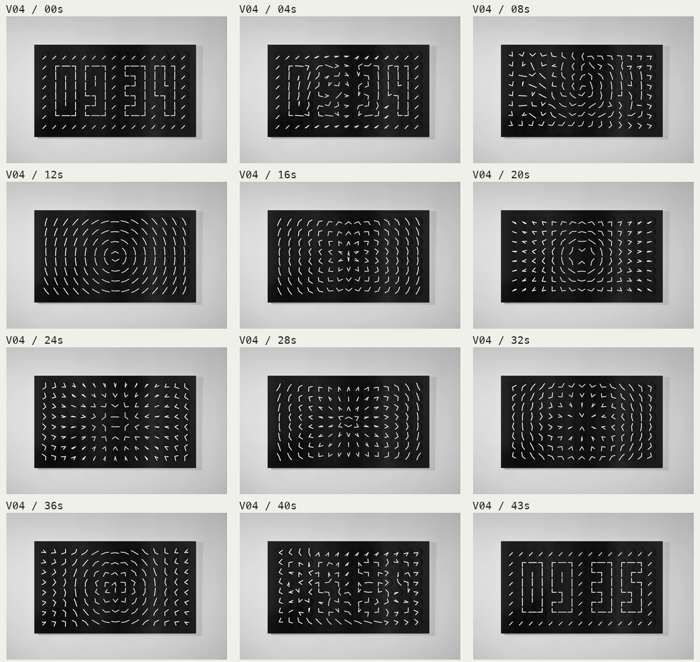
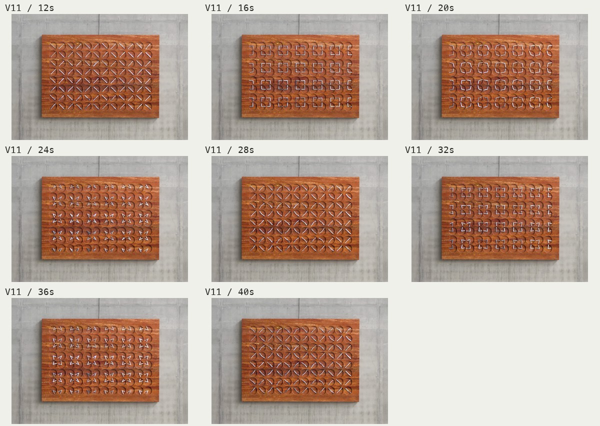
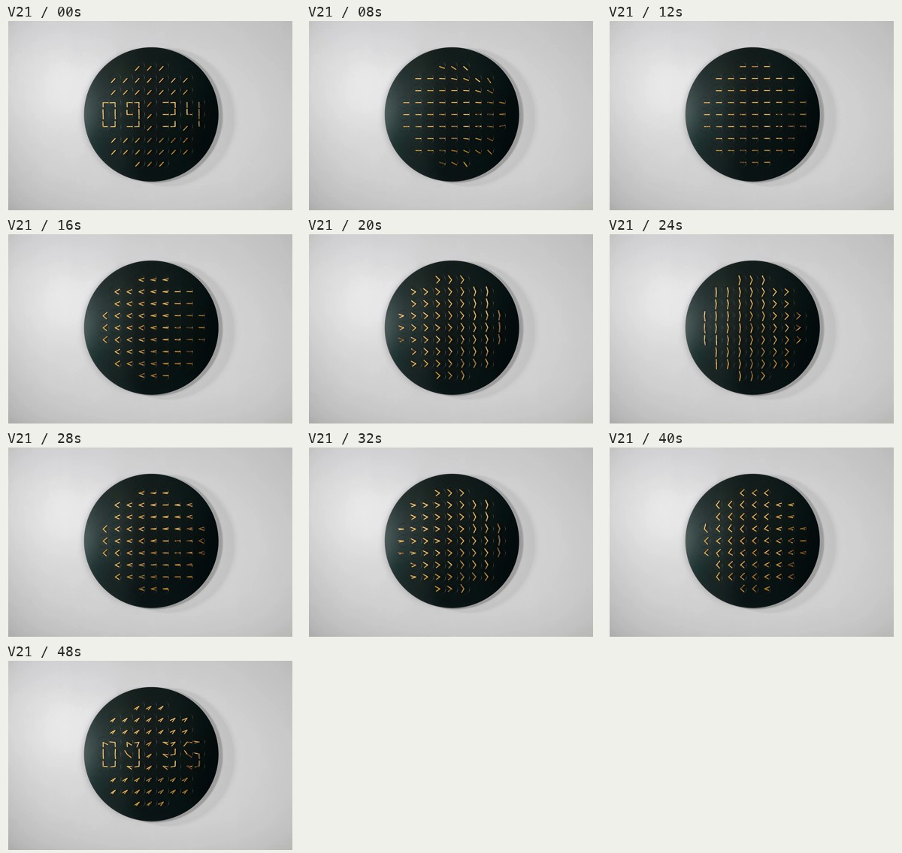
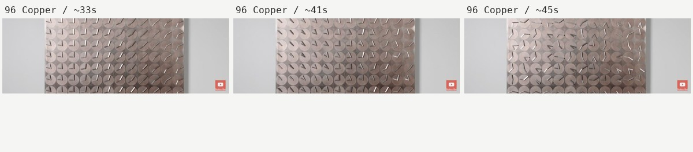

# A Million Times: A Guide to Visual Rules and Choreography

Research date: 2026-09-07. Sources: official A Million Times product photographs and website videos from Humans since 1982, the studio's YouTube channel, and local material supplied by the user.

**Clarity and fascination come from the same principle: many clocks follow a few recognizable relationships, and those relationships continuously produce new overall shapes.** Parallel columns, a shared center, and four clocks forming a square are easy to recognize. The relationships remain stable while opening angles, phases, and propagation change, making the image predictable without immediately exhausting its possibilities.

This study infers design rules from public imagery. The observations about viewing experience are interpretations from this research, not findings from cognitive experiments published by the studio.

[Open the choreography study](../index.html?study=1) · [Sources, contact sheets, and coverage](reference/official/catalog.md) · [Implementation design](implemented/official-choreography.md)

## Current catalog: 8 reference reconstructions + 7 independent studies

The catalog contains **eight official-reference reconstructions** and **seven independent studies**, for a total of 15 animated sequences. Weave is available as a static pattern. Off-canvas focal wave was removed after playback review; its source photograph and spatial measurements remain research material. The retained reconstructions include their images, sources, and cue frames, with playback links in Section 3. Each collection loops separately.

| Selected independent study | Defining feature |
|---|---|
| [Counter-rotation](../index.html?study=1&piece=counter-rotation) | Constant opposing rotation, with fixed row and column phases |
| [Column sweep](../index.html?study=1&piece=column-sweep) | Straight hand pairs and a direction gradient sweeping across columns |
| [Checkerboard](../index.html?study=1&piece=checkerboard) | Groups of four clocks; neighboring tiles exchange their opening and turning roles |
| [Twin vortices](../index.html?study=1&piece=twin-vortices) | Two local centers, producing a vortex on each side |
| [Mirrored vortex](../index.html?study=1&piece=mirrored-vortex) | One central focus and exact left-right reflection; opposing straight fields trace curved contours |
| [Concentric breathing](../index.html?study=1&piece=concentric-breathing) | Rings contract and expand together, slowing naturally at each reversal |
| [Diamond ripples](../index.html?study=1&piece=diamond-ripples) | Four diagonal directions; folds travel outward along diamond-shaped contours |

**Concentric breathing and Diamond ripples** are the two retained radial studies. The former uses circular directions and one shared opening angle for a synchronized breath. The latter combines four diagonal directions, the distance `|x| + |y|`, and propagation delay to create a travelling wave with crisp corners. They differ in both spatial outline and timing. Radial ripples and Radial echoes have been removed.

**Weave is available only as a static pattern.** It holds the former animation's initial 135° opening, preserving its groups of four clocks and half groups at the edges. After its entrance, it remains still. [Selection design](implemented/curated-choreography.md)

## 1. Treat photographs as evidence of rules



This image can look like randomly rotating short lines or several overlapping vortices. Closer inspection reveals three stronger constraints: each clock's hands are collinear, neighboring directions vary smoothly, and the field is approximately symmetric around a vertical axis. It is a **direction field**, with a shared spatial structure. [Official AMT288 White](https://www.humanssince1982.com/products/a-million-times-288-white)

Measuring the line directions of the 24 × 12 clocks in P032 gives a fit using a single distance function:

```text
r = hypot(column − 10.975, row + 1.025)
θ ≈ 363.539° − 20.9924° × r      (line directions are equivalent modulo 180°)
```

In practical terms, **place a focus about one cell above the top row, then reduce the angle by about 21° for every additional cell of distance.** The angular residual has a standard deviation of approximately 0.81° in this sample. This explains how straight hands collectively trace curved wave crests: the distribution of directions curves while the hands stay straight. The focus is not a physical pivot.

This photographic rule remains part of the research. Its animated interpretation has been removed from the playback catalog.

The measurement used the official image at 1400 pixels wide. Around manually located, evenly spaced centers, a 22-pixel-radius region was analyzed to estimate the principal axis of dark pixels. Doubled angles were unwrapped before fitting the distance model. Compression, shadows, center placement, and perspective can still affect the result. **0.81° is the fit residual for this image, not the overall reconstruction error or an accuracy figure published by the studio.** [Per-clock measurements](reference/official/photo-angles.json), [fit results](reference/official/photo-fit.json), [verification script](reference/official/measure-focus.py)



The 72v fan provides another example. Within each row, nearly every clock repeats the same angle; that angle increases down the matrix. All hands still rotate around their own fixed centers. A simple one-dimensional gradient creates a strong impression of a curved surface without requiring a separate trajectory for every clock. [Official AMT72v Black](https://www.humanssince1982.com/products/a-million-times-72v-black)

A photograph can establish spatial constraints, symmetry, repeating units, and negative space. It cannot establish sequence, direction, pauses, or speed. The playable interpretations of these photographic rules therefore state their evidence level explicitly.

## 2. A minimal visual grammar: direction, opening, and phase

Write the two hand angles as `θ₀ = μ + α` and `θ₁ = μ − α`. These must be continuously unwrapped angles; directly averaging screen angles across 0° gives the wrong result.

| Control | Responsibility | Visible forms |
|---|---|---|
| Mean direction μ | The direction shared by the pair | Arrow orientation and a common radial center |
| Half-opening angle α | How far the hands spread | Overlap at 0°, a right angle at 45°, a straight line at 90° |
| Spatial phase δ(x,y) | Which clocks enter the same movement first | Column waves, row waves, diagonal bands, and outward propagation |
| Group coordinates | Which clocks share a local center | Squares formed by four clocks, diamond lattices, and star tiles |

These parameters are an analytical description, not a claim about the studio's internal variables. Most visible forms need only one or two degrees of freedom. Keeping hand length, width, and centers fixed while varying direction preserves a consistent material character.

## 3. The eight retained official-reference reconstructions



The image above records the initial nine-entry research set; the current playback catalog below excludes Off-canvas focal wave. These are **reconstructions of public material**, not official names for the studio's private programs. Of the eight retained entries, four have continuous-video evidence, three show only partial motion, and one relies primarily on photographs. They include different spatial arrangements of related rules and should not be equated with eight independent official programs.

| Sequence / playback | Spatial rule | Motion evidence and limits |
|---|---|---|
| [Radial release](../index.html?study=1&piece=radial) | The mean direction follows the center; opening is delayed by radius | V04 12–36 s; V05/V06/V12/V23 show versions with different counts or materials |
| [Parallel column wave](../index.html?study=1&piece=columns) | Hands stay 180° apart; clocks in each column align and start together | V13 12–36 s; V01/V09/V24 repeat the same relationship |
| [Scissor wave](../index.html?study=1&piece=scissors) | Fixed mean direction, opposing hand rotation, and phase varying across columns | V21 12–40 s; V16 shows an interior recording |
| [Four-clock lattice](../index.html?study=1&piece=tiles) | A 2 × 2 group shares a local center and opening angle | V11 12–40 s; the official 48/80 Copper films show related forms |
| [Diagonal chevron wave](../index.html?study=1&piece=diagonal) | Both rows and columns contribute phase; hands open around a diagonal axis | V08 4–10 s includes occlusion and editing; speed and the complete cycle are approximate |
| [Parallel row fan](../index.html?study=1&piece=rows) | Parallel hands within each row, with a vertical direction gradient | P019/P021/P029/P034; motion is inferred |
| [Repeated radial wave](../index.html?study=1&piece=multi) | Repeated local centers create neighboring wave regions across a wide matrix | Partial Changi footage at 1:44–1:45; the spatial relationship is reconstructed, not individual trajectories |
| [Oblique scissor wave](../index.html?study=1&piece=scissors-diagonal) | A diagonal-axis variation of the scissor rule, synchronized within columns | 96 Copper around 33–41 s; the return to digits after 44 s is not counted as a new rule |

Time glyphs, overlapping half-strokes, parallel diagonals, and the square colon remain shared visual vocabulary. The seven sequences in the other collection are independent studies; Checkerboard and Twin vortices are not presented as verified official programs.

### Parallel column wave: make the order of movement visible



In V13, the time first dissolves into a shared diagonal alignment. The left side starts rotating while the right retains its direction. After the wave front passes, the clocks in each column move together. A still image shows a direction gradient; continuous viewing reveals a clear path of propagation. [Official AMT144 Black](https://www.humanssince1982.com/products/a-million-times-144-black)

At 20 s, sampled directions across one row are approximately 151°, 139°, 127°, 115°, 103°, 91°, and so on: a difference of about 11–12° per column. At 16 s, several columns on the right still sit near −45°. The stationary region is part of the choreography. The reconstruction uses smooth, delayed rotation to preserve the wave front without layering different oscillation frequencies onto every column. [Measurements](reference/official/parallel-measurements.json)

### Radial release: changing forms around a stable center



Around 12 s in V04, rings are recognizable. From 16–32 s, chevrons, arrows, and short lines change from the center outward. These forms emerge by continuously changing the opening angle around the same radial relationship. Phase differences between the inner and outer regions make the propagation readable. [Official AMT120 Black](https://www.humanssince1982.com/products/a-million-times-120-black)

Fix local directions first, then vary only the opening angle. Moving the center, adding several frequencies, and changing each hand's speed at the same time quickly weaken the common center. The reconstruction preserves radial delay and opposing rotation; it does not recover the video's exact acceleration curve.

### Four-clock lattice: use negative space to change the perceived unit



One clock contains two small bars. Seen as a group, four neighboring clocks outline a square in the space between them. As the hands continue opening, their relationships change: squares become a diamond lattice and then gather into stars. **The perceived unit shifts from one clock to the space between four clocks.** Half tiles at the left and right edges of V11 suggest that the pattern continues beyond the frame. [Official AMT96 Bjarke Ingels](https://www.humanssince1982.com/products/a-million-times-96-bjarke-ingels)

Define four directions in a 2 × 2 group and give them one continuous opening angle, so squares, diamonds, and stars belong to the same movement. The star phase must actually approach overlapping hands. Oscillating only between pair angles of 90° and 180° misses this form visible in the official footage.

The mixed chevrons around 24 s in the 80 Copper film occur near the return to digits. The lattice around 43 s follows the same family of four-clock rules. Those transitional frames are not counted as a separate official checkerboard program. [Official 80 Copper film](https://www.youtube.com/watch?v=diYVbEqybAM)

### Scissor wave: give a whole column one movement



In the Zephyr video, the hands first overlap to the right as short horizontal strokes. They then counter-rotate through chevrons, vertical straight lines, and reverse chevrons. Repeating the movement within each column and offsetting columns creates flowing bands. The circular outer boundary changes the crop while preserving the core angular relationship. [Official AMT61c Zephyr](https://www.humanssince1982.com/products/a-million-times-61c-zephyr)

This project adapts the rule to the rectangular 144-clock grid. It reconstructs the visual and motion relationships, not the 61c's circular enclosure or clock count.



At 33–41 s in the 96 Copper film, the bisectors lie diagonally and each column shares an opening angle. This is an orientation variant of the scissor column wave. Mixed poses around 45 s subsequently gather into digits, identifying them as part of the return rather than a separate random program. [Official 96 Copper film](https://www.youtube.com/watch?v=np7Yz-XALRI&t=33s)

## 4. Why the motion is readable and holds attention

**Begin with a rule the viewer can summarize.** A column turning together is easier to organize than 288 separate moving hands. Recognizing one column, ring, or tile explains the surrounding regions without tracking every part.

**Keep a relationship stable so its changes become visible.** Parallel columns direct attention to differences between columns. A fixed mean direction emphasizes the opening angle. Fixed local centers emphasize circular opening. Each stable relationship focuses attention on a small number of changes.

**Let new forms emerge from existing movement.** Bars become squares, then a lattice. Local motion stays simple while the overall grouping changes. Seeing the same parts suddenly form something else was the strongest source of fascination in this study.

**Show how order develops.** Regions retaining the old direction, a moving wave front, and regions already in the new form can coexist. The viewer can tell where the change is going. Sending the entire matrix along unrelated shortest paths weakens that spatial narrative.

**Use readable time as punctuation.** Accurate time appearing after flowing patterns provides a clear arrival. Holding the time gives the eye a stable reference again. The studio describes Active, Original, and Minimal modes. Its Active description mentions 20 choreographies and regular returns to time, but does not publish their individual names or complete trajectories. [Official product description](https://www.humanssince1982.com/products/a-million-times-144-white)

## 5. Structure of a sequence

| Stage | Visual purpose | Design method | Check |
|---|---|---|---|
| Time / opening | Establish a stable reference | Hold until the digits can be read | Is the time readable without an explanation? |
| Dissolution | Give the old form a direction of departure | Start by column, radius, or repeating group | Can the viewer identify the wave front and its direction? |
| Establishing the rule | Make the relationship recognizable | Parallel lines, rings, or groups of four clocks | Can one frame be described in a sentence? |
| Development | Generate variation within one rule | Change a main phase or opening while preserving groups | Are key forms clearly reached rather than rushed past? |
| Return | Establish a clear destination | Gather into digits while retaining readable structure | Does the destination become clearer as it approaches? |
| Hold | Complete the phrase | Maintain accurate time | Is there enough stable viewing time? |

In common website clips, the entrance, main movement, and return total about 43–56 seconds. Editing and playback speed may vary, so this is not evidence of a shared schedule for every official program. This project uses a 24-second main movement with time holds; its existing continuous-trajectory system plans entrances and returns. Departures from typography choose a random formation axis and one of six spatial directions, staggering rows, columns, or concentric rings over six seconds at 1×. Minute modes shorten the main movement when the complete route needs more time. These surrounding stages are project choices and **do not claim frame-by-frame agreement with the source films**. [Directional departure design](implemented/directional-departures.md)

## 6. A practical design process

1. **Build a strong still frame first.** With fixed centers and two fixed-length hands, make parallel groups, a center, or a repeated unit readable even at thumbnail size. Avoid relying on glow, color, or scaling to explain the form.
2. **Write one invariant.** Examples include a shared angle within each column, a shared opening for four clocks, or a direction determined only by distance. If none is clear, reduce the degrees of freedom.
3. **Choose one main change.** Rotate a straight pair, open the hands, or propagate a local action. Establish the first change clearly before adding another.
4. **Design at least three recognizable moments.** A lattice's squares, diamonds, and stars should lie on one trajectory. Use cue poses to verify that the motion reaches them.
5. **Arrange spatial phase.** Synchronization establishes a relationship; small offsets create propagation. Use columns, rows, radius, or group indices instead of random per-clock delays.
6. **Give forms time to arrive and leave.** Preserve continuous velocity at entry and exit. Hold when it supports reading or recognition; avoid forcing a stop at every turn.
7. **Calibrate speed last.** Get distances, angular differences, and grouping right first. At 1×, excessive speed should not conceal a complicated transition.
8. **Check stillness and movement separately.** Pause to inspect composition, slow down to inspect paths, and use normal speed to judge rhythm. Random screenshots cannot replace continuous observation.

## 7. Reconstruction limits and validation

The studio describes its simulation tools and choreography process, establishing that the work uses a deliberate motion-design system. Public material does not provide reusable programs, complete trajectories, or every constraint. [Official Savoir-faire](https://www.humanssince1982.com/pages/savoir-faire)

This project reconstructs visible rules procedurally. Its 18 × 8 grid, hand proportions, smooth interpolation, speed limits, and return strategy are implemented independently. The study view and documentation distinguish photographic inference from partial-video evidence instead of presenting either as a confirmed complete official animation.

The eight reference reconstructions and seven independent studies are checked together for continuity of position, velocity, and acceleration; peaks across each complete interpolation polynomial; interruptions between sequences; returns to text; and minute scheduling. The normal 1× limit is 30°/s; rates above 1× are explicitly for debugging. That limit is a project constraint, not an official hardware specification.

The request to cover everything discoverable is represented by a traceable inventory: contact sheets for all 28 website videos, a catalog of 76 official image URLs, and inspection status for 59 YouTube entries. Some videos still failed to buffer or were not checked throughout, and private official programs remain unpublished. The evidence does not support a claim to have recovered all 20 proprietary choreographies. New clear evidence can extend the catalog through the same process: source, invariant, cue poses, and continuous trajectory. Different materials showing the same movement do not require duplicate implementations.
